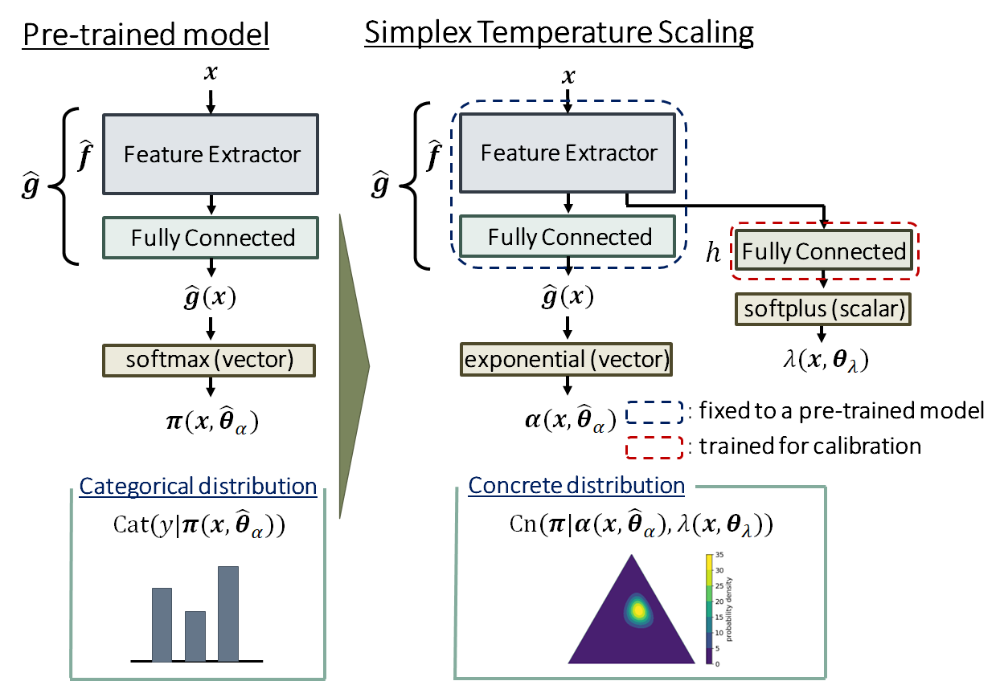

# Accuracy-Preserving Calibration via Statistical Modeling on Probability Simplex

<p align="left">
    <a href="https://developer.nvidia.com/cuda-11-3-1-download-archive" alt="CUDA">
        </a>
    <a href="https://www.python.org/downloads/release/python-3810/" alt="Python">
        </a>
    <a href="https://pypi.org/project/torch/1.11.0/" alt="Pytorch">
        </a>
</p>

This is an official Pytorch implementation of "Accuracy-Preserving Calibration via Statistical Modeling on Probability Simplex". 
This study was presented at AISTATS 2024 (acceptance rate: 27.6%). [[arXiv](https://doi.org/10.48550/arXiv.2402.13765)|[PMLR](https://proceedings.mlr.press/v238/esaki24a.html)]

<div align="center">

</div>

## Preparation

1. Git clone this repository.
   
    ```bash
    git clone https://github.com/ToyotaCRDL/SimplexTS.git
    ```

2. Build a Docker image using `Dockerfile` and `requrements.txt`.

    ```bash
    docker build --build-arg USER=${USER} --build-arg GROUP=$(id -gn) \
            --build-arg UID=$(id -u) --build-arg GID=$(id -g) \
            --tag simplex-ts SimplexTS
    ```

3. Launch a container.

    ```bash
    docker run -it --rm --gpus all \
            --mount type=bind,source=$(pwd)/SimplexTS,target=${HOME}/SimplexTS \
            --workdir ${HOME}/SimplexTS simplex-ts
    ```

We conducted our experiments on a NVIDIA A100 GPU.

## Example

The following is a demonstration of FashionMNIST.
  
1. Train a model for classification. This is Step 1, as described in Section 4.1 of [this paper](https://doi.org/10.48550/arXiv.2402.13765).

    ```bash
    bash scripts/classification.sh
    ```

2. Calibrate a model using Simplex Temperature Scaling (STS). This is Step 2, as described in Section 4.1 of [this paper](https://doi.org/10.48550/arXiv.2402.13765).

    ```bash
    bash scripts/calibration.sh
    ```

## Citation

To cite our work, you can use the following:

```bibtex
@inproceedings{SimplexTS,
  title     = {Accuracy-Preserving Calibration via Statistical Modeling on Probability Simplex},
  author    = {Esaki, Yasushi and Nakamura, Akihiro and Kawano, Keisuke and Tokuhisa, Ryoko and Kutsuna, Takuro},
  booktitle = {Proceedings of The 27th International Conference on Artificial Intelligence and Statistics},
  pages     = {1666--1674},
  year      = {2024},
  volume    = {238},
  series    = {PMLR}
}
```

## License

Copyright (C) 2025 TOYOTA CENTRAL R&D LABS., INC. All Rights Reserved.